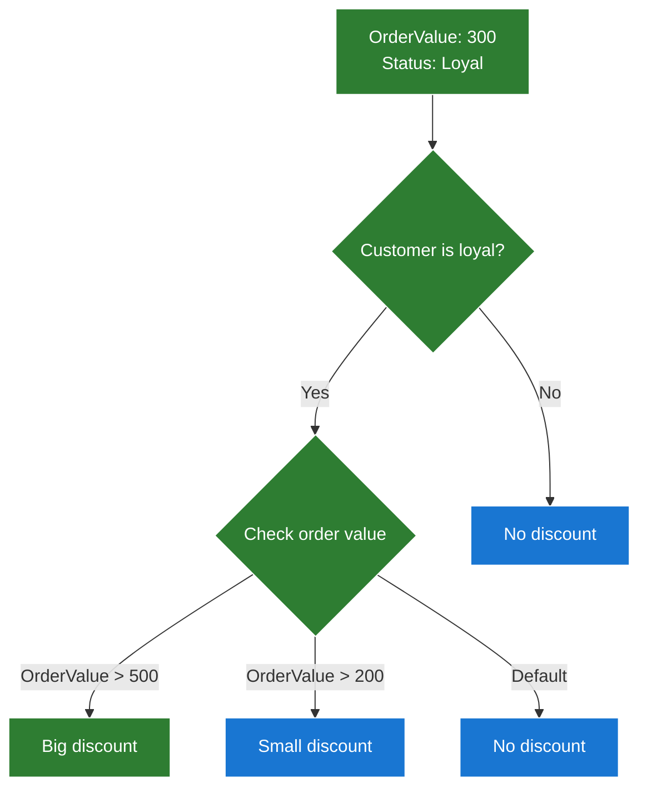

# Cinnamon Trees 🌳

A lightweight, extensible rule-tree engine for building and visualizing logical decision trees in .NET.

> Designed for rule-based systems like discounts, eligibility flows, decision paths — not machine learning.

---

## 🌳 Why Decision Trees for Business Logic?

**Business rules are naturally tree-like.** "If customer is VIP, then check order value. If over $500, apply big discount, otherwise small discount." This reads like a decision tree because it *is* one.

**Traditional approaches make this harder than it needs to be:**
- **Endless if/else chains** — hard to read, harder to maintain
- **Complex rule engines** — overkill for most scenarios  
- **Spreadsheet logic** — disconnected from your code
- **Hard-coded conditions** — every change requires a deployment

**CinnamonTrees makes it simple:**
- **Fluent builder pattern** — construct trees naturally in code
- **Type-safe outcomes** — your results are enums, not magic strings
- **Execution tracking** — see exactly which path was taken
- **Easy testing** — verify specific scenarios with clear assertions
- **Extensible nodes** — add your own decision logic when needed

Build complex business logic that actually makes sense to read and maintain.

---

## 💼 Why Visualization Matters

**Complex business rules are hard to communicate.** Try explaining a multi-step discount logic to stakeholders using code or documentation — you'll lose them in the first paragraph.

**Visual decision trees solve this problem:**
- **Stakeholders understand the logic** — no technical knowledge required
- **Changes are easier to discuss** — point to the diagram, not lines of code  
- **Testing becomes visual** — trace the path through the tree for any scenario
- **Documentation stays current** — generated from actual code, never outdated
- **Onboarding is faster** — new team members see the business logic immediately

When business rules change (and they always do), having a visual representation means everyone — developers, product managers, business analysts — can collaborate on the same level.

---

## 🚀 Features

- 🧠 **Decision nodes** for building custom logic trees:
  - **BinaryDecisionNode** — standard decision node with two branches (yes/no)
  - **CaseDecisionNode** — supports 2 to 8 branches plus default branch
- 🍃 **Leaf nodes** are represented as enums, allowing clear and type-safe outcomes
- ⚡ **Fast execution engine** with history tracking
- 🖼️ **Visual documentation** — automatically generate diagrams that business stakeholders can actually understand and validate
- 📈 **Business communication** — turn complex rules into visual flows that non-technical stakeholders can review and approve
- 🧪 **Snapshot tests** and sample rule scenarios

---

## 📦 Project Structure

```
src/
├── Core/                       # Tree engine logic
├── visualization/
│   └── Mermaid/               # Mermaid diagram generation
├── samples/
│   ├── Discounts/             # Sample use case
│   └── Discounts.Tests/       # Tests for the sample, engine and diagram generation
```

---

## 📥 Installation

```bash
dotnet add package CinnamonTrees.Core
dotnet add package CinnamonTrees.Visualization.Mermaid
```

---

## 🧾 Example

```csharp
var tree = DiscountTreeBuilder.Build();
var result = tree.Evaluate(cart);

var diagram = MermaidVisualizeTree.VisualizeTree(tree);
```

---

## 📊 Visualization (Mermaid)



> This diagram was automatically generated from code. When you change business rules, the documentation updates itself. No more outdated flowcharts or confusing verbal explanations during stakeholder meetings.

---

## 🧪 Testing

- Unit and snapshot tests live next to the samples.
- Mermaid diagrams are tested using `.mmd` snapshot files.

```bash
dotnet test
```

---

## 🤝 Contributing

Pull requests, ideas, and feedback welcome!

1. Fork the repo
2. Create a branch
3. Submit a PR

---

## 🐾 Fun Fact

The name **CinnamonTrees** comes from my cat, Cynamonka (Cinnamon Roll) 🐱.


---

## 🙏 Special Thanks

Special thanks to [@kgrzybek](https://github.com/kgrzybek) for originally proposing the idea of rule trees in one of our earlier projects.  
The concept turned out to be very effective — and when a similar problem appeared again in another context, it felt like the perfect fit once more.  
This library was created to generalize and expand that idea, adding features like `CaseNode` and visualization support.

---

## 📝 License

Licensed under the [MIT License](LICENSE).  
You are free to use, modify, and distribute this software. Attribution is appreciated.
