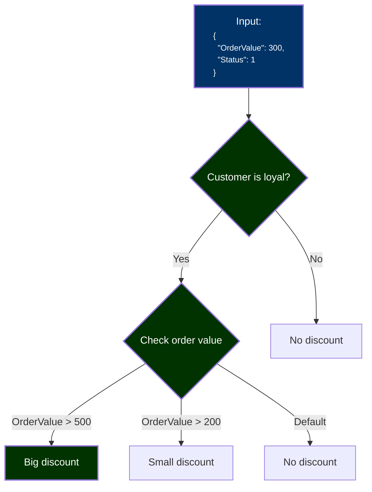

# CinnamonTrees 🌳

A lightweight, extensible rule-tree engine for building and visualizing logical decision trees in .NET.

> Designed for rule-based systems like discounts, eligibility flows, decision paths — not machine learning.

---

## 🚀 Features

- 🧠 **Decision nodes** for building custom logic trees:
  - **BinaryDecisionNode** — standard decision node with two branches (yes/no)
  - **CaseDecisionNode** — supports 2 to 8 branches plus default branch
- 🍃 **Leaf nodes** are represented as enums, allowing clear and type-safe outcomes
- ⚡ **Fast execution engine** with history tracking
- 🖼️ **Visualization support** (e.g. Mermaid)
- 🧪 **Snapshot tests** and sample rule scenarios

---

## 📦 Project Structure

```
src/
├── Core/                       # Tree engine logic
├── visualization/
│   └── Mermaid/               # Mermaid diagram generation
├── samples/
│   ├── Discounts/             # Sample use case
│   └── Discounts.Tests/       # Tests for the sample, engine and diagram generation
```

---

## 📥 Installation

```bash
dotnet add package CinnamonTrees.Core
dotnet add package CinnamonTrees.Visualization.Mermaid
```

---

## 🧾 Example

```csharp
var tree = DiscountTreeBuilder.Build();
var result = tree.Evaluate(cart);

var diagram = MermaidVisualizeTree.VisualizeTree(tree);
```

---

## 📊 Visualization (Mermaid)



---

## 🧪 Testing

- Unit and snapshot tests live next to the samples.
- Mermaid diagrams are tested using `.mmd` snapshot files.

```bash
dotnet test
```

---

## 🤝 Contributing

Pull requests, ideas, and feedback welcome!

1. Fork the repo
2. Create a branch
3. Submit a PR

---

## 🐾 Fun Fact

The name **CinnamonTrees** comes from my cat, Cynamonka (Cinnamon Roll) 🐱.


---

## 🙏 Special Thanks

Special thanks to [@kgrzybek](https://github.com/kgrzybek) for originally proposing the idea of rule trees in one of our earlier projects.  
The concept turned out to be very effective — and when a similar problem appeared again in another context, it felt like the perfect fit once more.  
This library was created to generalize and expand that idea, adding features like `CaseNode` and visualization support.

---

## 📝 License

Licensed under the [MIT License](LICENSE).  
You are free to use, modify, and distribute this software. Attribution is appreciated.
